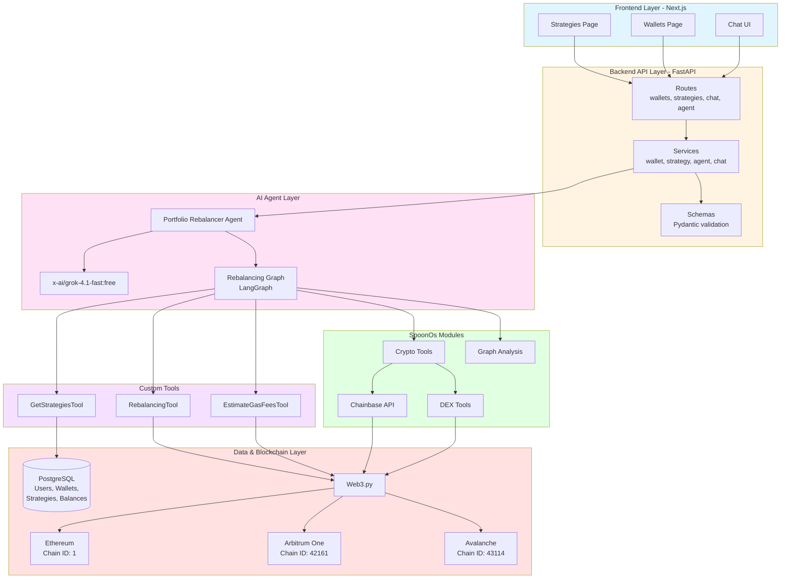

# System Architecture Schema

## Mermaid Diagram



## Technology Stack

```
┌─────────────────────────────────────────────────────────────────┐
│                        System Architecture                       │
└─────────────────────────────────────────────────────────────────┘

┌─────────────────────────────────────────────────────────────────┐
│                         Frontend Layer                            │
│                         Next.js Application                      │
│  ┌──────────────┐  ┌──────────────┐  ┌──────────────┐         │
│  │  Strategies  │  │   Wallets    │  │   Chat UI    │         │
│  │    Page      │  │    Page      │  │              │         │
│  └──────────────┘  └──────────────┘  └──────────────┘         │
└─────────────────────────────────────────────────────────────────┘
                              │
                              │ HTTP/REST API
                              ▼
┌─────────────────────────────────────────────────────────────────┐
│                      Backend API Layer                           │
│                      FastAPI Application                         │
│  ┌──────────────┐  ┌──────────────┐  ┌──────────────┐         │
│  │   Routes     │  │   Services   │  │   Schemas    │         │
│  │  - wallets   │  │  - wallet    │  │  (Pydantic)  │         │
│  │  - strategies│  │  - strategy  │  │              │         │
│  │  - chat      │  │  - agent     │  │              │         │
│  │  - agent     │  │  - chat      │  │              │         │
│  └──────────────┘  └──────────────┘  └──────────────┘         │
└─────────────────────────────────────────────────────────────────┘
                              │
                              │
┌─────────────────────────────────────────────────────────────────┐
│                    AI Agent Layer                                │
│              Portfolio Rebalancer Agent                          │
│              Model: x-ai/grok-4.1-fast:free                      │
│                                                                  │
│  ┌──────────────────────────────────────────────────────────┐  │
│  │              Rebalancing Graph (LangGraph)                │  │
│  │  ┌──────────┐  ┌──────────┐  ┌──────────┐              │  │
│  │  │  Analyze │→ │ Calculate │→ │ Execute  │              │  │
│  │  │ Portfolio│  │Rebalancing│  │  Trades  │              │  │
│  │  └──────────┘  └──────────┘  └──────────┘              │  │
│  └──────────────────────────────────────────────────────────┘  │
└─────────────────────────────────────────────────────────────────┘
                              │
                              │ Uses Tools
                              ▼
┌─────────────────────────────────────────────────────────────────┐
│                         Tools Layer                              │
│                                                                  │
│  ┌──────────────────────────────────────────────────────────┐  │
│  │              SpoonOs Modules                               │  │
│  │  ┌──────────────────┐  ┌──────────────────┐             │  │
│  │  │  Crypto Tools    │  │  Graph Analysis  │             │  │
│  │  │  - DEX Tools     │  │                  │             │  │
│  │  │  - Chainbase     │  │                  │             │  │
│  │  └──────────────────┘  └──────────────────┘             │  │
│  └──────────────────────────────────────────────────────────┘  │
│                                                                  │
│  ┌──────────────────────────────────────────────────────────┐  │
│  │              Custom Tools                                  │  │
│  │  ┌──────────────────┐  ┌──────────────────┐             │  │
│  │  │ GetStrategiesTool│  │ RebalancingTool  │             │  │
│  │  │                  │  │                  │             │  │
│  │  │ EstimateGasFeesTool│                  │             │  │
│  │  └──────────────────┘  └──────────────────┘             │  │
│  └──────────────────────────────────────────────────────────┘  │
└─────────────────────────────────────────────────────────────────┘
                              │
                              │
┌─────────────────────────────────────────────────────────────────┐
│                    Data & Blockchain Layer                       │
│                                                                  │
│  ┌──────────────────┐              ┌─────────────────────────┐ │
│  │   PostgreSQL     │              │   Blockchain Networks    │ │
│  │   Database       │              │                         │ │
│  │                  │              │  ┌───────────────────┐  │ │
│  │  - Users         │              │  │   Ethereum        │  │ │
│  │  - Wallets       │              │  │   (Chain ID: 1)   │  │ │
│  │  - Strategies    │              │  └───────────────────┘  │ │
│  │  - Token Balances│              │  ┌───────────────────┐  │ │
│  │  - Chat Messages │              │  │  Arbitrum One     │  │ │
│  │                  │              │  │  (Chain ID: 42161)│  │ │
│  │                  │              │  └───────────────────┘  │ │
│  │                  │              │  ┌───────────────────┐  │ │
│  │                  │              │  │   Avalanche      │  │ │
│  │                  │              │  │  (Chain ID: 43114)│ │ │
│  │                  │              │  └───────────────────┘  │ │
│  └──────────────────┘              └─────────────────────────┘ │
│         │                                    │                   │
│         │                                    │ Web3              │
│         └────────────────────────────────────┘                   │
└─────────────────────────────────────────────────────────────────┘
```

## Component Details

### Frontend (Next.js)
- **Strategies Page**: Manage portfolio rebalancing strategies
- **Wallets Page**: View and manage connected wallets
- **Chat UI**: Interactive interface for agent communication

### Backend API (FastAPI)
- **Routes**: RESTful API endpoints
- **Services**: Business logic layer
- **Schemas**: Data validation with Pydantic

### AI Agent Layer
- **Model**: x-ai/grok-4.1-fast:free
- **Graph**: LangGraph-based rebalancing workflow
- **Agent**: Portfolio Rebalancer Agent

### Tools

#### SpoonOs Modules
- **Crypto Tools**
  - DEX Tools: Decentralized exchange operations
  - Chainbase: Blockchain data queries
    - Get account balances
    - Get account tokens
    - Get transactions
    - Get blocks
    - Contract calls

- **Graph Analysis**: Network and relationship analysis

#### Custom Tools
- **GetStrategiesTool**: Retrieve user's portfolio strategies
- **RebalancingTool**: Calculate and execute rebalancing actions
- **EstimateGasFeesTool**: Estimate transaction costs

### Supported Networks
- **Ethereum** (Chain ID: 1)
- **Arbitrum One** (Chain ID: 42161)
- **Avalanche** (Chain ID: 43114)

### Data Storage
- **PostgreSQL**: Persistent storage for users, wallets, strategies, token balances, and chat messages

## Data Flow

```
User Request (Next.js)
    ↓
API Route (FastAPI)
    ↓
Service Layer
    ↓
Agent/Graph (LangGraph)
    ↓
Tools (SpoonOs + Custom)
    ↓
Blockchain (Web3) / Database (PostgreSQL)
    ↓
Response back to User
```

## Technology Stack Summary

| Layer | Technology |
|-------|-----------|
| Frontend | Next.js |
| Backend API | FastAPI (Python) |
| AI Model | x-ai/grok-4.1-fast:free |
| Graph Framework | LangGraph |
| Database | PostgreSQL |
| Blockchain | Web3.py |
| SpoonOs Modules | Crypto Tools (DEX, Chainbase), Graph Analysis |
| Custom Tools | GetStrategiesTool, RebalancingTool, EstimateGasFeesTool |
| Networks | Ethereum, Arbitrum One, Avalanche |

